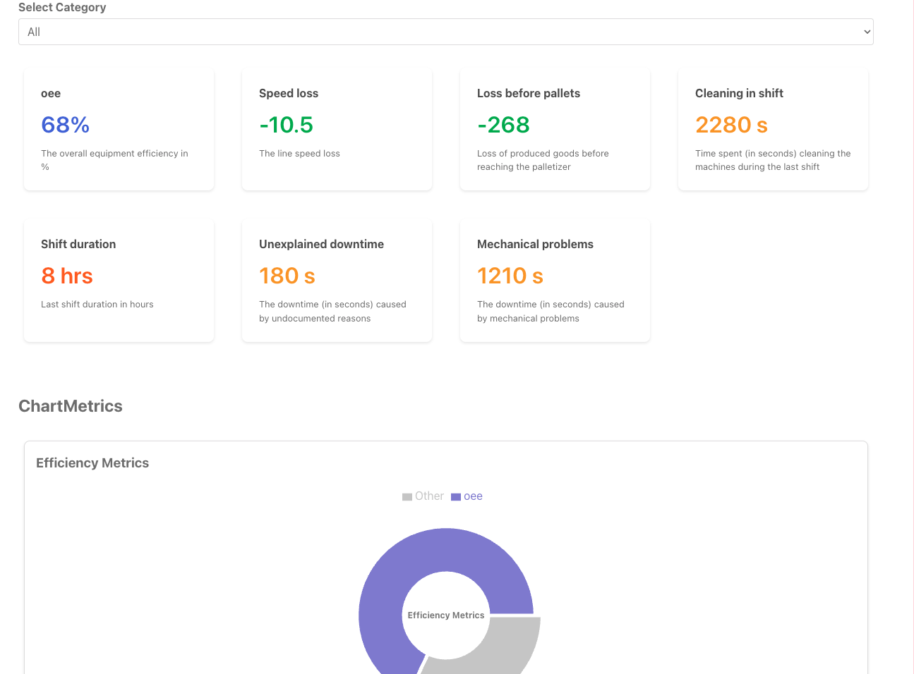

# FactoryPal UI Application

# Table of Contents

- [Getting Started](#getting-started)
- [Technology Stack](#technology-stack)
- [Installation](#installation)
- [Testing](#testing)
- [Features](#features)
- [Questions](#questions)
- [Support or Contribution](#support-or-contribution)
- [Status](#status)

## Getting Started
This is a clientside javascript application built [React JS](https://reactjs.org/) application.

## Technology Stack

**Client Side**
1. TypeScript
2. React JS
3. ReCharts
4. Styled-Components

## Installation

1. Install [**Node JS**](https://nodejs.org/en/).

2. Clone the [**repository here**](https://github.com/benfluleck/factory-pal.git)
3. [**cd**] into the root of the **project directory**.
4. Run `bun install` on the terminal to install project dependecies

## Testing

Client side tests - Run `bun run test` on the terminal while within the **project root directory**.

E2E tests - Run `bun run e2e` on the terminal while within the **project root directory**.

Client side testing is achieved through the use of the `vitest` package and `react-testing library`.

End to End testing is achieved with the help of `Cypress`

## Features
- Coming soon

## Questions
For more details contact benfluleck@gmail.com

## Support or Contribution
For any suggestions or contributions or issues please do raise them or email me.
For **Contributiions**, Please clone the repo and implement a PR I would appreciate it

## Status
Still undergoing testing
